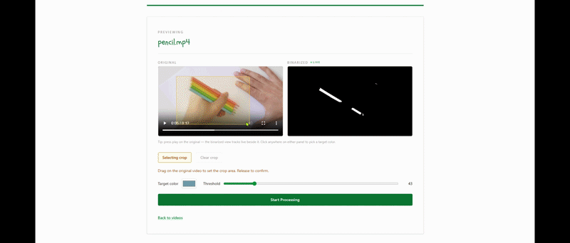

# Salamander Project — Backend

A tool for analysing videos of lizards moving on a flat surface. It binarizes each frame based on a target color and threshold, then finds the centroid of the largest contiguous mass (the lizard).



> **Frontend repo:** [salamander-project-frontend](https://github.com/AhmedIhsan123/salamander-project-frontend)

---

## Team Members
- Elvin Hrytsyuk
- Ahmed Ihsan
- Jacob Gerken

---

## Tech Stack
- **Java** — image processing core (DFS-based group finder, color binarization)
- **Node.js / Express** — REST API server
- **Maven** — Java build tool

---

## Setup

### Prerequisites
- Java 17+
- Node.js 18+

### 1. Clone the repository
```bash
git clone https://github.com/Elvin-code-dev/centroid-finder.git
cd centroid-finder
```

### 2. Install server dependencies
```bash
cd server
npm install
```

### 3. Configure environment variables
Create a `.env` file in the **project root** (one level above `server/`):

```env
PORT=3000
VIDEOS_DIR=../videos
JAR_PATH=../target/videoprocessor.jar
```

| Variable     | Required | Description                                              |
|--------------|----------|----------------------------------------------------------|
| `PORT`       | No       | Port the server listens on. Defaults to `3000`.          |
| `VIDEOS_DIR` | Yes      | Path to videos directory, relative to `server/`.         |
| `JAR_PATH`   | Yes      | Path to the processor JAR, relative to `server/`.        |

### 4. Start the backend
```bash
node server/index.js
```

Server runs at `http://localhost:3000`.

---

## How It Works

1. Upload a video through the frontend
2. Select a target color and threshold
3. The backend runs the Java JAR frame-by-frame, binarizing each frame and finding the centroid of the largest detected group
4. Results are returned as a CSV with centroid coordinates per frame
